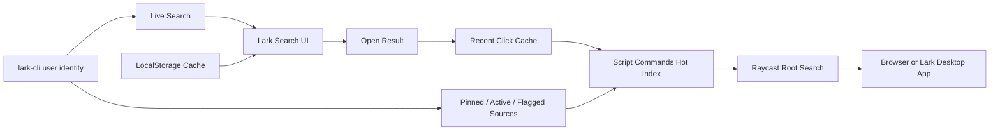

# Raycast Lark Search 产品说明书

## 1. 背景

飞书客户端内置全局搜索能力，可以搜索云文档、消息、群组、联系人等内容，并支持按范围筛选。但该能力局限在飞书客户端内部，用户在系统其他应用中需要先切回飞书，再触发搜索，存在明显上下文切换成本。

Raycast 是系统级启动器和搜索入口。Lark Search 的目标是把飞书内容接入 Raycast，让用户在系统任意位置唤起 Raycast 后，可以快速搜索、定位并打开飞书内容。

本产品不是单纯做一个 Raycast 内的飞书搜索命令，而是采用混合策略：

- 高频对象进入 Raycast Root Search。
- 长尾搜索进入 Raycast Extension 内完成。
- 搜索执行层优先复用 `lark-cli`，避免在 extension 内直接维护复杂 OpenAPI 细节。

## 2. 当前定位

当前 extension 名称为 `Lark Search`，包名为 `lark-search`。

当前落地方案：

- Root Search 高频直出：使用 Raycast Script Commands Hot Index。
- 长尾实时搜索：使用 `lark-cli` live search。
- 本地低延迟体验：使用 Raycast `LocalStorage` 保存最近打开结果和历史搜索缓存。
- Quicklinks：保留手动创建和导出能力，不作为 Root Search 自动导入的主路径。

调整原因：

- Raycast Quicklinks 自动导入需要人工 UI 配合，不适合作为稳定自动化索引。
- Raycast Extension 不能动态注入远端搜索结果到 Root Search。
- Script Commands 可以被 Raycast 原生索引，且脚本文件可由 extension 静默维护。
- 当前数据规模只需要轻量缓存，SQLite FTS 暂未成为 MVP 必需项。

官方 Store 一句话描述建议：

```text
搜索飞书/Feishu/Lark docs, messages, chats, and contacts from Raycast.
```

## 3. 产品目标

核心目标：

- 降低从系统环境进入飞书搜索的操作成本。
- 让常用飞书对象直接出现在 Raycast Root Search 中。
- 在 Lark Search 内提供接近飞书搜索的分组、范围筛选、上下文展示和快速打开体验。
- 支持文档、消息、联系人、群组等主要对象。
- 使用 `lark-cli` 用户身份和权限模型，避免越权或重复维护认证。

## 4. 目标用户

主要用户：

- 高频使用飞书和 Raycast 的个人用户。
- 需要频繁查找文档、群聊、历史消息的研发、产品、运营、项目管理人员。
- 同时参与多个项目和群组，需要快速定位上下文的团队成员。

典型诉求：

- 快速打开最近或高频访问的云文档。
- 快速进入常用群聊或私聊。
- 快速搜索历史消息。
- 快速查找联系人。
- 不希望每次搜索都先切回飞书客户端。

## 5. 核心体验

### 5.1 Root Search 高频直出

用户在 Raycast 根页面直接输入文档名、群名、联系人名等关键词，即可命中本地 Script Commands Hot Index。

Hot Index 特性：

- 默认目录：`~/Documents/Raycast Script Commands/Lark Hot Index`。
- 默认生成前 50 个高频对象。
- 脚本标题使用飞书对象原始标题，不再添加 `Lark Chat:` / `View Lark Doc:` 等生硬前缀。
- `@raycast.packageName` 和 `@raycast.description` 补充类型、更新时间、群消息更新时间、摘要、部门、邮箱等上下文。
- `@raycast.icon` 使用脚本目录内 `.assets/*.png` 相对路径，避免绝对 SVG/远端头像导致 Raycast 回退为默认文档图标。
- 文档类脚本使用 `open URL`，直接浏览器打开。
- 群聊、私聊、消息脚本使用 `open -b com.larksuite.larkApp URL`，优先直达飞书客户端，减少浏览器中转。

用户需要在 Raycast 设置中添加一次 Script Commands 目录：

```text
Raycast Settings > Extensions > Script Commands > Add Directories
```

### 5.2 Lark Search 长尾搜索

用户打开 `Lark Search` 命令后，可搜索飞书文档、消息、联系人、群组等对象。

当前搜索框英文提示：

```text
Search Lark, append /doc /msg /im to filter
```

支持先展示本地缓存结果，再并行调用 `lark-cli` 查新并刷新结果，降低重复搜索的等待感。

### 5.3 搜索范围筛选

支持两种筛选方式：

- 搜索框右侧下拉范围：全部、云文档、消息、群组、联系人、知识库、表格。
- 搜索词结尾追加 `/` 标识符。

已支持的结尾标识符：

```text
文档名 /doc
消息关键词 /msg
人名或群名 /im
关键词 /doc /msg
关键词 /doc /msg /im
```

说明：

- `/doc` 搜索云文档，并按返回内容识别普通文档、Wiki、表格/多维表格等类型。
- `/msg` 搜索消息。
- `/im` 泛指联系人和群组。
- 多个 `/` 标识符可以组合，显示全量匹配范围内结果。

### 5.4 结果展示

当前 Lark Search 结果展示策略：

- 联系人和群组混合展示，优先出现在顶部。
- 默认只预览前 8 个联系人/群组结果，显式使用 `/im` 过滤时展示全量。
- 分类展示顺序以联系人/群组优先，其后为消息、云文档、Wiki、表格等。
- 标题、摘要、部门、邮箱、更新时间、群消息更新时间等信息尽量在一行内展示，减少分栏割裂。
- 搜索结果会解码 HTML 实体，避免显示 `&amp;` 等转义字符。
- 对有命中摘要的结果展示上下文片段。
- `lark-cli` 返回的 `<h>...</h>` 高亮标记会被清理；当前 List UI 以纯文本展示，富文本高亮还未完成。

### 5.5 打开和操作

当前支持：

- 文档类结果直接浏览器打开。
- 群聊、消息、联系人结果优先用飞书桌面端 bundle 打开。
- 打开后调用 `closeMainWindow({ clearRootSearch: true })`，避免飞书已经跳转但 Raycast 仍停留在前台。
- 打开结果会写入最近访问缓存，并即时更新 Hot Index。
- 支持复制链接。
- 支持复制标题。
- 支持复制 Raw JSON 便于调试。
- 支持把单个结果手动添加为 Raycast Quicklink。

## 6. 已实现功能清单

| 功能                           | 当前状态                                          |
| ------------------------------ | ------------------------------------------------- |
| Raycast 命令 `Lark Search`     | 已实现                                            |
| `lark-cli` 用户身份搜索        | 已实现                                            |
| 云文档搜索                     | 已实现                                            |
| 消息搜索                       | 已实现                                            |
| 群组搜索                       | 已实现                                            |
| 联系人搜索                     | 已实现                                            |
| Wiki / 表格类型识别            | 已实现，依赖 docs 搜索结果元数据                  |
| 搜索范围下拉筛选               | 已实现                                            |
| `/doc /msg /im` 结尾过滤       | 已实现                                            |
| 多个 `/` 过滤同时生效          | 已实现                                            |
| 本地最近打开缓存               | 已实现，最多 100 条                               |
| 历史搜索结果缓存               | 已实现，最多 50 个 query/scope 条目               |
| 缓存先显示、live search 后刷新 | 已实现                                            |
| 打开结果并记录点击             | 已实现                                            |
| 点击结果后更新 Hot Index       | 已实现                                            |
| 文档浏览器打开                 | 已实现                                            |
| 群聊/消息/联系人飞书客户端打开 | 已实现                                            |
| 打开后关闭 Raycast             | 已实现                                            |
| 复制链接/标题/Raw JSON         | 已实现                                            |
| 手动创建 Quicklink             | 已实现                                            |
| Quicklinks JSON 导出           | 已实现，但不是主索引路径                          |
| Script Commands Hot Index      | 已实现                                            |
| Hot Index 3 分钟后台刷新       | 已实现，`Refresh Lark Hot Index` interval 为 `3m` |
| Hot Index 初始化引导           | 已实现                                            |
| Hot Index 本地图标资产         | 已实现                                            |
| lark-cli 最小版本和 scope 提示 | 已在初始化引导和 README 中提示                    |

## 7. Hot Index 数据来源与排序

Hot Index 数据来源分层：

- Raycast 内打开过的 Lark 结果。
- Feed 置顶会话：`lark-cli im +feed-shortcut-list --as user --json`。
- 最近活跃群/私聊：`lark-cli im +chat-list --as user --types group,p2p --sort-type ByActiveTimeDesc --page-size 80 --json`。
- 收藏消息：`lark-cli im +flag-list --as user --page-size 20 --json`。

排序权重：

- Feed 置顶会话权重最高。
- 最近活跃会话次之。
- 收藏消息进入 Root Search。
- 本地打开过的结果按点击次数和最近打开时间加权。
- 最终去重后生成前 50 个可被 Raycast Root Search 索引的 Script Commands。

## 8. lark-cli Adapter

当前搜索命令：

```bash
lark-cli docs +search --as user --query "关键词" --page-size 20 --json
lark-cli im +messages-search --as user --query "关键词" --no-reactions --page-all --page-limit 10 --page-size 50 --json
lark-cli im +chat-search --as user --query "关键词" --page-size 100 --json
lark-cli contact +search-user --as user --query "关键词" --page-size 30 --json
```

当前 Hot Index 命令：

```bash
lark-cli im +feed-shortcut-list --as user --json
lark-cli im +chat-list --as user --types group,p2p --sort-type ByActiveTimeDesc --page-size 80 --json
lark-cli im +flag-list --as user --page-size 20 --json
```

基础要求：

- `lark-cli >= 1.0.53`
- 已完成 `lark-cli` 用户登录。

主搜索最小 scope：

```bash
lark-cli auth check --scope "search:docs:read search:message im:chat:read contact:user.base:readonly"
```

Hot Index 可选增强 scope：

```bash
lark-cli auth check --scope "im:feed.shortcut:read im:feed.flag:read"
```

## 9. 当前架构

```text
Raycast Root Search
  -> Script Commands Hot Index
  -> Lark object URL / Lark desktop app deep link

Lark Search Extension
  -> LocalStorage recent cache
  -> LocalStorage query cache
  -> lark-cli live search
  -> result merge / dedupe / rank
  -> open result
  -> record open
  -> update Hot Index
```



## 10. 差距与后续事项

### 10.1 Root Search 真实头像

当前 Root Search 使用 `.assets/lark-contact.png`、`.assets/lark-chat.png` 等本地图标，保证不会回退成默认文档图标。

未完成：

- 群聊接口返回 avatar URL，但 Root Search Script Command 当前仍使用通用群聊图标，尚未下载并缓存真实群头像。
- 私聊联系人在当前 `lark-cli im +chat-list` 和 `contact +get-user` 返回中没有 avatar URL，因此无法显示真实人物照片。后续需要 lark-cli 增加带头像的用户接口或更高权限字段。

### 10.2 富文本高亮

当前已清理 `<h>` 标记并展示上下文，但 Raycast `List.Item` 标题/副标题仍是纯文本，未实现像飞书一样的黄色命中高亮。

可选方案：

- 增加 `List.Item.Detail` 展示 markdown 高亮和上下文。
- 在列表标题中保留纯文本，选中项右侧展示高亮详情。

### 10.3 正式 fallback command

代码层面已读取 `props.fallbackText` 和 `arguments.query`，但当前 `package.json` 尚未声明一个稳定的 fallback command 入口。Root Search 长尾承接当前主要依赖用户手动打开 `Lark Search`，或依赖 Raycast 行为触发。

后续需要验证 Raycast 当前版本的 fallback command manifest 配置，并补齐正式入口。

### 10.4 分页与“展开更多”

当前 `lark-cli` 调用内部会拉取多页或 page-all，但 Raycast UI 没有做飞书式“展开更多”按钮，也没有无限滚动分页。

### 10.5 联系人/群组混排与折叠细节

当前联系人和群组已混合展示，并默认限制前 8 个。后续可继续优化：

- 更贴近飞书原始排序。
- 对显式 `/im` 搜索展示更多联系人/群组上下文。
- 将“展开更多”作为 Raycast action 或独立 filter。

### 10.6 开发安装稳定性

开发过程中多次改变 `author` 或反复运行 `ray develop` 会在 Raycast Settings 中产生多个本地开发 extension 注册项。

后续规范：

- 固定 `name: lark-search` 和 `author: jyufu_ko`。
- 日常验证优先使用 `npm run lint` 和 `npm run build`。
- 只有需要重新注册本地 extension 时才短暂运行 `ray develop --non-interactive`，注册完成后立即停止。

## 11. 非目标

MVP 阶段不追求：

- 把所有飞书消息都注入 Raycast Root Search。
- 修改 Raycast 私有数据库。
- 绕过飞书权限模型搜索用户不可见内容。
- 做全量消息归档或长期消息备份。
- 完整复刻飞书 `Ctrl+K` UI。
- 在当前 lark-cli 不返回头像字段的情况下强行伪造真实联系人头像。

## 12. 一句话总结

Lark Search 是一个飞书内容到 Raycast 搜索体系的索引桥。

当前版本用 Script Commands Hot Index 解决 Root Search 高频直出，用 `lark-cli` live search 解决长尾搜索，用 LocalStorage 缓存降低重复搜索延迟，并保留 Quicklinks 作为手动补充能力。
